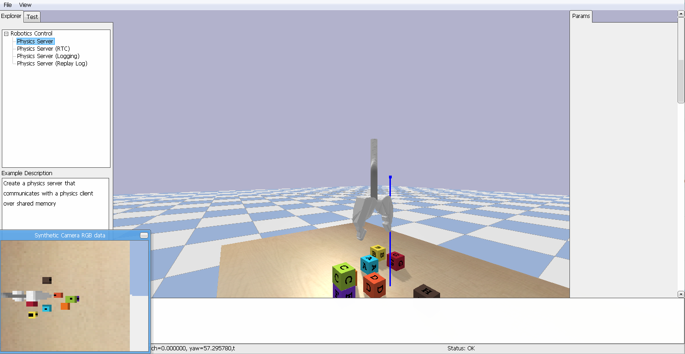

# NTP Vat



This repo contains an implementation of the BulletPhysics environment used in the paper [Neural Task Programming: Learning to Generalize Across Hierarchical Tasks](https://arxiv.org/abs/1710.01813). If you find this repo useful, please use the following bib to cite our paper.

```
@inproceedings{xu18ntp,
  title={Neural Task Programming: Learning to Generalize Across Hierarchical Tasks},
  author={Xu D, Nair S, Zhu Y, Gao J, Garg A, Fei-Fei L, Savarese S.},
  booktitle={International Conference on Robotics and Automation},
  year={2018}
 }
```

This repo is adapted from [Kuan Fang](https://github.com/kuanfang/)'s PyBullet wrapper (VAT). Note that the environment only contains the PR2 gripper model. The full Sawyer robot simulation environment will be released soon.

### Requirements:
1. Python 2.7

2. Note that this repo only works with PyBullet 1.2.9. I'm working on a fix to make it work with the newest PyBullet release (1.8)
- Install `Bullet 3.x.` by `pip install pybullet==1.2.9` or simply `pip install -r requirements.txt`.

### Usage:

Demo: run `python demo.py --time_step 0.001` to execute expert policy of the Block Stacking task.
